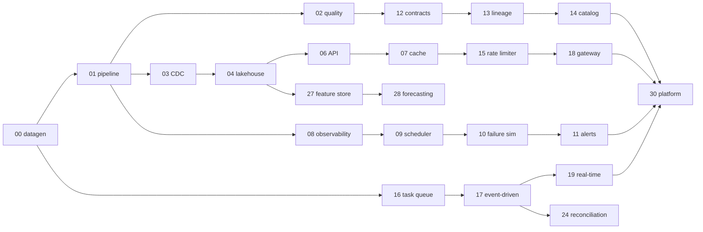

  

One working system per day for 30 days, all built on the same synthetic e-commerce dataset, so each project can pick up where the previous ones left off: the pipeline from day 1 feeds the lakehouse on day 4, which feeds the API on day 6, which gets a cache on day 7, and so on until day 30 wires everything into one platform.

## Rules

1. Every number in a README comes from a benchmark or a real run committed under `results/`, with the hardware it ran on. If a change made no difference, the README says so.
2. Every project runs with one command, has tests, and has CI.
3. Each README explains the engineering decisions and trade-offs, not only the stack.
4. Limitations are written down.

## Progress

`4 / 31` (day 00 is setup)

| Day | Project | What it shows | Stack | Status |
|---:|---|---|---|---|
| 00 | [shopflow-datagen](https://github.com/silvano-moraes-de-souza/shopflow-datagen) · [de-project-template](https://github.com/silvano-moraes-de-souza/de-project-template) | Deterministic synthetic data, project template, benchmark harness | Python, NumPy, PyArrow | done |
| 01 | [ecommerce-data-pipeline](https://github.com/silvano-moraes-de-souza/ecommerce-data-pipeline) | Raw to star schema in PostgreSQL, idempotent batches, reconciliation; COPY 2.7x faster than INSERT (measured) | Python, PostgreSQL, Docker | done |
| 02 | [data-quality-engine](https://github.com/silvano-moraes-de-souza/data-quality-engine) | 8 check types in YAML, quality score, CI gate; finds all 6 injected problem types with exact counts; business rule vs IQR measured | Python, Polars | done |
| 03 | [postgres-cdc-pipeline](https://github.com/silvano-moraes-de-souza/postgres-cdc-pipeline) | Watermark, trigger log and WAL (pgoutput) capture scored against a simulated source with deletes and slow commits; versioned upserts, SCD2 history | Python, PostgreSQL | done |
| 04 | Mini Lakehouse | Bronze, silver, gold; partitioning | Parquet, PyArrow, DuckDB | next |
| 05 | SQL Performance Lab | Indexes and plans, measured with EXPLAIN ANALYZE | PostgreSQL | |
| 06 | Sales Analytics API | REST over the gold layer | FastAPI, DuckDB | |
| 07 | API Cache Layer | Cache-aside, TTL, invalidation, p50/p95 latency | Redis | |
| 08 | Pipeline Observability | Metrics, structured logs, dashboards | Prometheus, Grafana | |
| 09 | Pipeline Job Scheduler | DAGs, dependencies, run state | Python, PostgreSQL | |
| 10 | Pipeline Failure Simulator | Retries, backoff, reprocessing, recovery time | Python | |
| 11 | Data Alerting System | Threshold rules, alert deduplication | Python | |
| 12 | Data Contract Validator | Schemas, breaking-change detection in CI | Pydantic, JSON Schema | |
| 13 | Data Lineage Tracker | Source to transform to consumer | Python, networkx | |
| 14 | Mini Data Catalog | Dataset metadata, owners, search | FastAPI, Next.js | |
| 15 | Distributed Rate Limiter | Token bucket vs sliding window | Redis, Lua | |
| 16 | Distributed Task Queue | Workers, acks, throughput by worker count | Redis / RabbitMQ | |
| 17 | Event-Driven Order System | Idempotency, DLQ, correlation IDs | FastAPI, RabbitMQ, PostgreSQL | |
| 18 | API Gateway | Routing, auth, rate limiting | FastAPI, httpx | |
| 19 | Real-Time Analytics Dashboard | Streaming aggregation windows | RabbitMQ, DuckDB, Next.js | |
| 20 | Resilient Web Scraper | Retries, checkpoints, dedup, success rate | httpx, parsel | |
| 21 | Document Processing Pipeline | OCR, extraction, error queue | Tesseract, PyMuPDF | |
| 22 | CSV/Excel to Data Warehouse | Spreadsheet ingestion with validation | Python, DuckDB | |
| 23 | Financial Anomaly Detector | z-score, IQR, isolation forest, scored against injected anomalies | scikit-learn | |
| 24 | Financial Reconciliation Engine | Matching, divergences, audit trail | Python, SQL | |
| 25 | Product Recommendation Engine | Co-occurrence, offline precision@k | Python | |
| 26 | Local Search Engine | Inverted index, BM25 ranking | Python | |
| 27 | Mini Feature Store | Offline/online features, point-in-time joins | DuckDB, Redis | |
| 28 | Demand Forecasting Pipeline | Backtested time series forecasts | statsforecast | |
| 29 | ETL Benchmark Lab | Pandas vs Polars vs DuckDB, time and memory | Python | |
| 30 | Mini Data Engineering Platform | Everything above, wired together | Docker Compose | |

## Results so far

Every number below comes from a benchmark committed in the project's `results/` folder.

| Day | Headline result |
|---:|---|
| 00 | 19.5M rows of synthetic e-commerce data generated in 23.7 s; memory grows 16% from scale 10 to 50 |
| 01 | COPY loads 2.7x faster than batched INSERT; 3.9M rows raw to star schema in 248 s, reconciled to the cent |
| 02 | 6 of 6 injected problem types found with the exact row count; business rule 100% precise vs 20% for IQR |
| 03 | WAL and trigger-queue capture end with 0 wrong rows; the timestamp watermark with 11,893; WAL sync 5x faster than a full reload on 2M rows |

  

## How the projects connect

## Shared building blocks

| Piece | What it gives every project |
|---|---|
| [shopflow-datagen](https://github.com/silvano-moraes-de-souza/shopflow-datagen) | The same customers, products, orders and payments at any scale, with an optional dirty mode that records exactly which problems it injected |
| [de-project-template](https://github.com/silvano-moraes-de-souza/de-project-template) | Layout, CI, Docker, benchmark harness and banner, created with one command |

## Author

Silvano Moraes de Souza · [GitHub](https://github.com/silvano-moraes-de-souza) · [Portfolio](https://silvanomsouza.vercel.app/)
